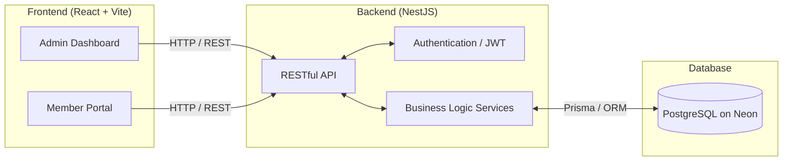
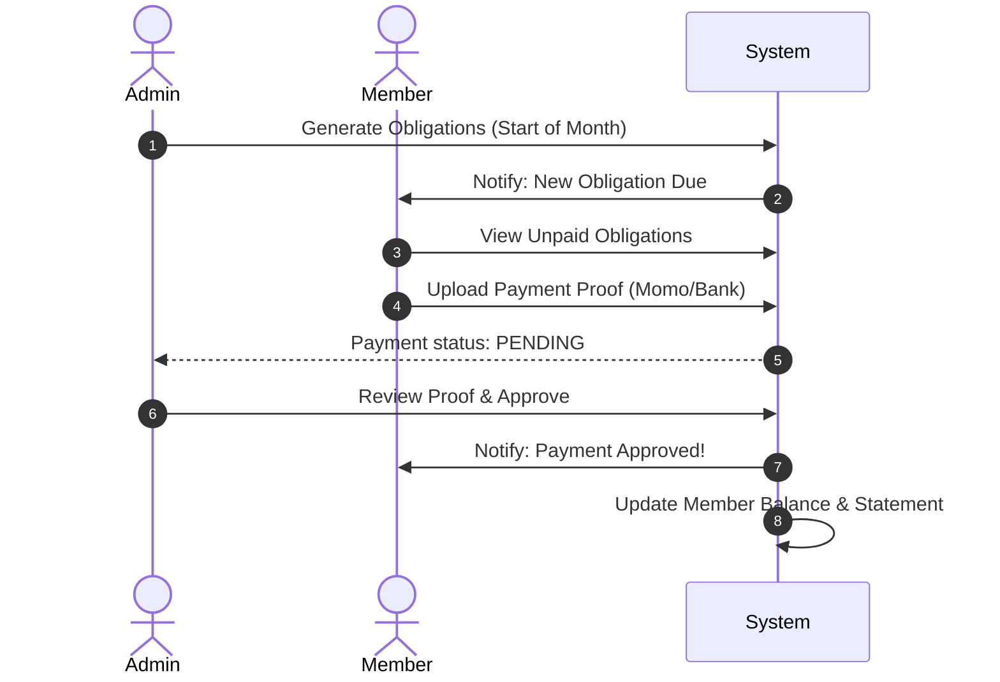
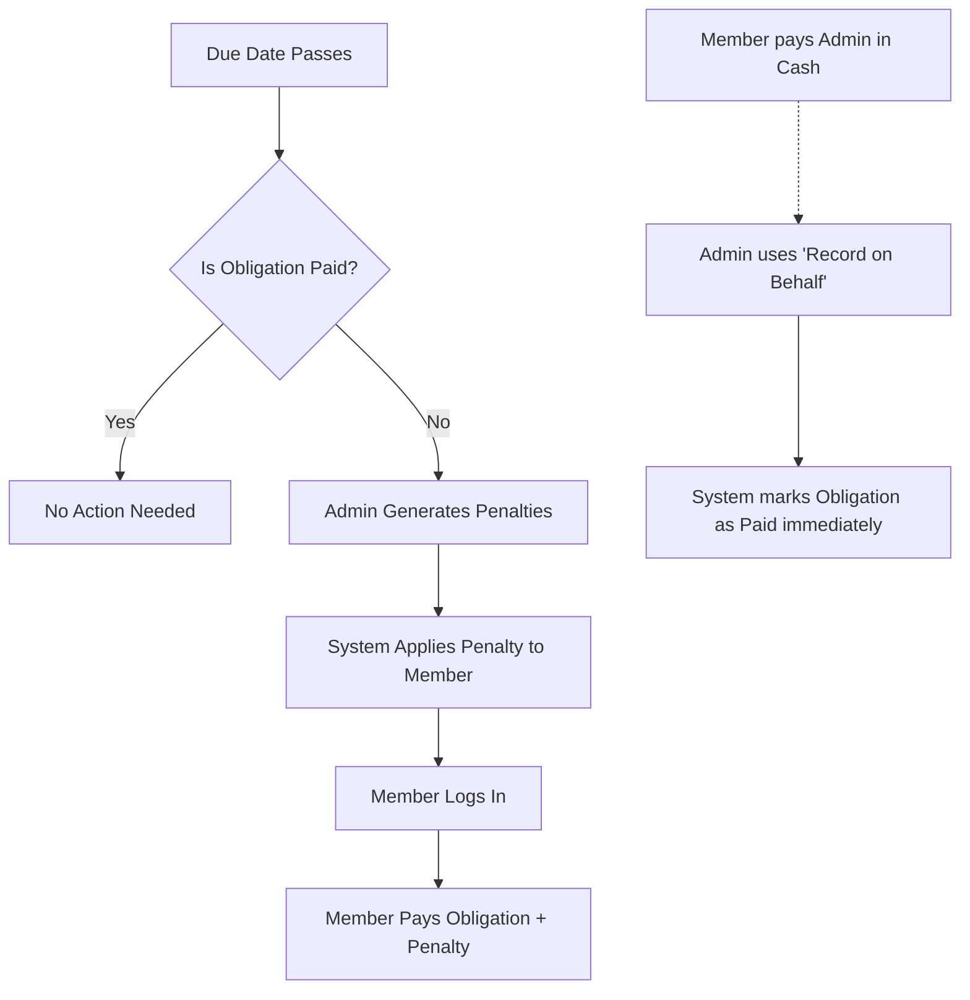

# Ikimina Platform - Project Overview

## 🎯 The Main Goal of the Project
The **Ikimina Platform** is designed to digitize, automate, and streamline the management of traditional savings groups (known as "Ikimina"). 

Historically, tracking monthly contributions, calculating late penalties, and maintaining transparent financial statements for these groups has been a manual and error-prone process. This platform solves that by providing a centralized system where:
- **Administrators** can easily onboard members, auto-generate monthly obligations, approve incoming payments, enforce penalties, and monitor the overall financial health of the group.
- **Members** get full transparency. They can log in to view their dashboard, see unpaid obligations, submit digital proofs of payment (e.g., Mobile Money receipts), and view their historical financial statements.

---

## 🏗️ System Architecture

The platform uses a modern, decoupled web architecture:



---

## 🔄 Core User Flows

### 1. The Monthly Cycle Flow
Here is how a standard month operates within the platform:



### 2. Penalty & Exceptions Flow
If a member fails to pay on time, the system handles it gracefully:



---

## 🚀 How to Run the Project locally

The project is split into two distinct directories. You will need two terminal windows open to run both simultaneously.

> **Important:** Ensure you have **Node.js** installed and your Neon PostgreSQL database URI configured in the backend `.env` file before starting.

### 1. Start the Backend
The backend serves the API and connects to the database.

1. Open your terminal and navigate to the backend folder:
   ```bash
   cd ikmn-backend
   ```
2. Install dependencies (only needed the first time):
   ```bash
   npm install
   ```
3. Start the development server:
   ```bash
   npm run start:dev
   ```
   *The backend will be running at `http://localhost:3000`*

### 2. Start the Frontend
The frontend is the user interface built with React.

1. Open a **new** terminal window and navigate to the frontend folder:
   ```bash
   cd ikimina-platform-frontend
   ```
2. Install dependencies:
   ```bash
   npm install
   ```
3. Start the Vite development server:
   ```bash
   npm run dev
   ```
   *The terminal will display a local URL (usually `http://localhost:5173`). Click it to open the app.*

### 3. Running the End-to-End Tests
If you want to verify that the backend is functioning flawlessly, you can run the automated E2E script. 
*Note: The backend must be running (Step 1) before you execute this.*

```bash
# In the root of the project repository
bash test-all-ikmn-project.sh
```

---

## 🔑 Default Access
To log in and explore the system:
- **Admin Email:** `didier@gmail.com`
- **Password:** `didier123`
